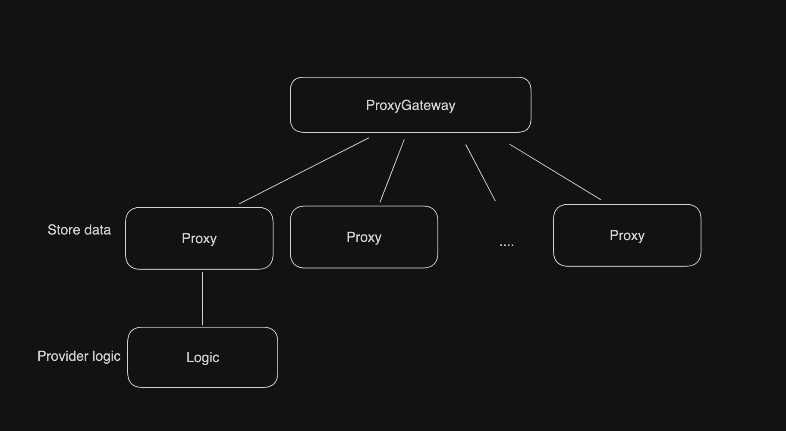
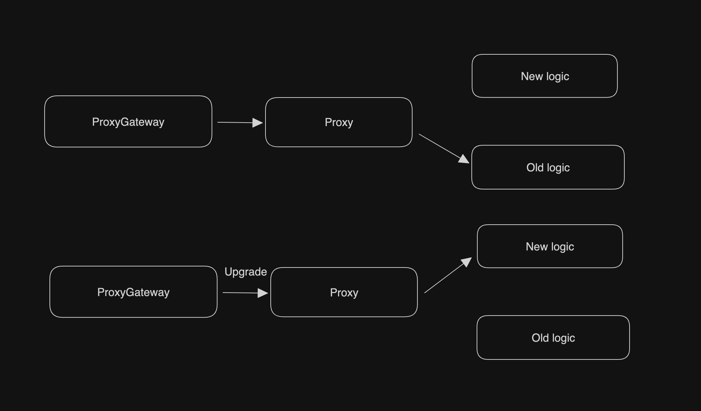

# Design

## Overview
The primary function of the parent chain smart contract is to receive block data from the subnet node, verify it, and store it. 

**Noteworthy aspects:**

   - Every block data received will be verified to ensure the signature is signed by validators and has passed with 2/3 of the votes.

   - In the gap block occurring in the middle of each epoch, a `next` may appear, which will be selected for temporary storage.

   - In each epoch block, a `current` may appear, which will choose the `next` selected during the gap as validators from the current block to the next epoch.

   - Only three consecutive blocks of `roundNumber` can confirm the previous block, and `mainnetNum` will change from -1 to `block.number` once the block is committed.

## Specifics

### Checkpoint

The Checkpoint contract implements a blockchain checkpoint system, which verifies and stores block header information for subnetworks. Here are some key functions and features:

- The contract defines several data structures, such as `Header`, `HeaderInfo`, `Validators` and `BlockLite`. These structures are used to store block header information, validator information, and more.

- The contract employs several mappings and other variables to track the current block header tree, committed blocks, validator set, latest block, and so forth.

- The contract's constructor receives the initial validator set, the genesis block header, the first block header, etc., as parameters and initializes the contract state based on these.

- The `receiveHeader` function allows users to submit new block headers. This function will verify the meta information of the block header (like block number, parent block hash, etc.), the signature certificate, and update the block's submission status when specific conditions are met.

- Functions such as `setLookup`, `setCommittedStatus`, `checkUniqueness`, and `checkCommittedStatus` are used to update or check the contract's internal status.

- Functions like `getHeader`, `getHeaderByNumber`, `getLatestBlocks` and `getCurrentValidators` enable users to query block header information, validator sets, etc.

- The `splitSignature` and `recoverSigner` functions are used to recover the signer's address from the signature, which is necessary for verifying the block header signature.

**Logic Flow:**

1. Checkpoint uses the following parameters for contract construction:

   - `address[]  initial_validator_set `: List of initial validator addresses
   - `bytes genesis_header`: block0HexRLP
   - `bytes block1_header`: block1HexRLP
   - `uint64 gap`: GAP block number on public chain
   - `uint64 epoch`: EPOCH block number on public chain

2. Relayers need to fetch every block data from the subnet node.

3. Users can retrieve the information of each block using methods such as `getHeader`.

### Lite Checkpoint

Lite Checkpoint is a lightweight block header checkpoint. It implements several functions, including:

   - Setting the initial validator set and related parameters during contract initialization.
   - Checking whether the submitted block header meets the requirements.
   - Receiving and processing submitted block headers.
   - Submitting the block header and block header by block number.
   - Retrieving uncommitted block header information.
   - Accessing specific block header information.
   - Fetching the current and next round of epoch blocks according to the index.
   - Getting the latest block information.
   - Accessing the current set of validators.

**Logic Flow:**

1. Lite Checkpoint uses the following parameters for contract construction:

   - `address[]  initialValidatorSet `: List of initial validator addresses
   - `bytes block1`: block1HexRLP
   - `uint64 gap`: GAP block number on public chain
   - `uint64 epoch`: EPOCH block number on public chain

2. Relayers only need to fetch gap/epoch block data and fetch the following consecutive `roundNumber` blocks to confirm the signed gap/epoch block from the subnet node.

3. Users can get gap/epoch block information from methods such as `getHeader`.

### Upgradeable module

The Upgradeable module mainly revolves around the concept of transparent proxies and the ability to upgrade the underlying logic contracts without changing the contract's address.

#### ProxyGateway Smart Contract

The `ProxyGateway` smart contract plays a central role in this module. It inherits from `ProxyAdmin` and primarily serves the purpose of creating and managing transparent upgradeable proxies (`TransparentUpgradeableProxy`).

**Key Components and Functionalities**:

- **cscProxies**: 
  - A mapping used to store two types of transparent upgradeable proxies.
    - `0` represents "full"
    - `1` represents "lite"

- **CreateProxy Event**: 
  - Emitted whenever a new transparent upgradeable proxy is created.

- **createProxy Function**: 
  - Creates a new `TransparentUpgradeableProxy`.
  - Emits the `CreateProxy` event upon creation.

- **createFullProxy Function**: 
  - Specifically designed for creating a transparent upgradeable proxy of type "full".
  - Checks if a "full" type proxy already exists.
  - Ensures the provided logic contract has a `MODE` function that returns "full".

- **createLiteProxy Function**: 
  - Designed for creating proxies of type "lite".
  - Checks if a "lite" type proxy already exists.
  - Ensures the provided logic contract has a `MODE` function that returns "lite".

**Logic Flow:**

1. **Initialization**:
   
   The process begins with the `ProxyGateway` contract, which serves as a central hub for creating transparent upgradeable proxies. The contract owner has the capability to create either "full" or "lite" proxies.
   
2. **Proxy Creation**:

   - The owner calls either the `createFullProxy` or `createLiteProxy` function based on the desired type of proxy.
   - The specified logic contract's `MODE` is checked to ensure it matches the desired proxy type.
   - A new `TransparentUpgradeableProxy` is created with the specified logic contract, the `ProxyGateway` as the admin, and any necessary initialization data.
   - The new proxy's address is stored in the `cscProxies` mapping under its corresponding type.
   - The `CreateProxy` event is emitted to log the creation of the new proxy.

3. **Upgrading the Proxy**:

   When there's a need to upgrade the underlying logic of the proxy (for instance, to introduce new features or fix bugs):

   - A new logic contract version is deployed to the network.
   - The owner (or authorized entity) of the `ProxyGateway` contract calls the inherited `upgrade` function from `ProxyAdmin` to point the proxy to the new logic contract.
   - The proxy now delegates all calls to the new logic contract, while still retaining all its previous storage and state.
   - This enables the system to evolve and implement new functionalities without migrating to a new contract address or affecting the contract's stored data.

4. **Interacting with the Proxy**:

   Users and other contracts can interact with the proxy just as they would with a regular contract. However, behind the scenes, all function calls and data accesses are delegated to the current logic contract that the proxy points to.

5. **Querying and Data Access**:

   Users and contracts can still query data, access functions, or invoke transactions on the proxy's address. The proxy transparently delegates these to the underlying logic contract, ensuring continuity of operations.

6. **Advanced Management**:

   Through the `ProxyAdmin` functionality, the owner can further manage the proxy, such as changing the admin or even downgrading to a previous version of the logic contract if needed.

