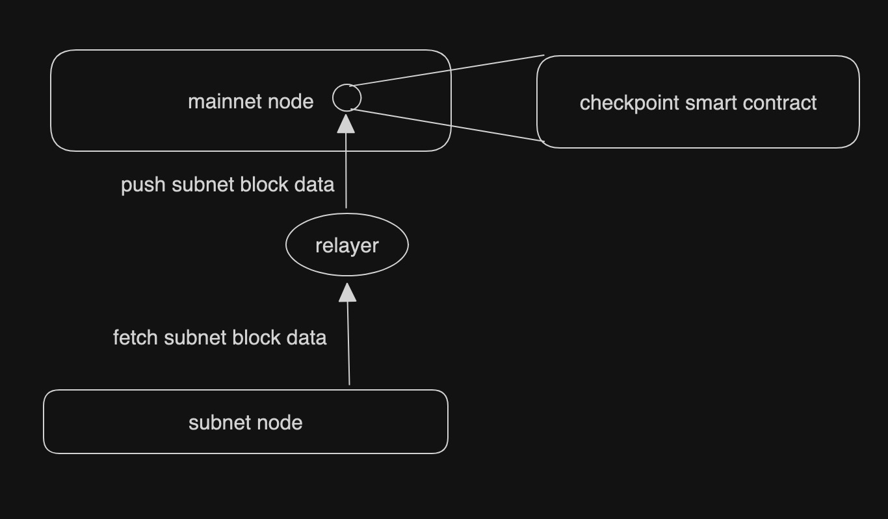
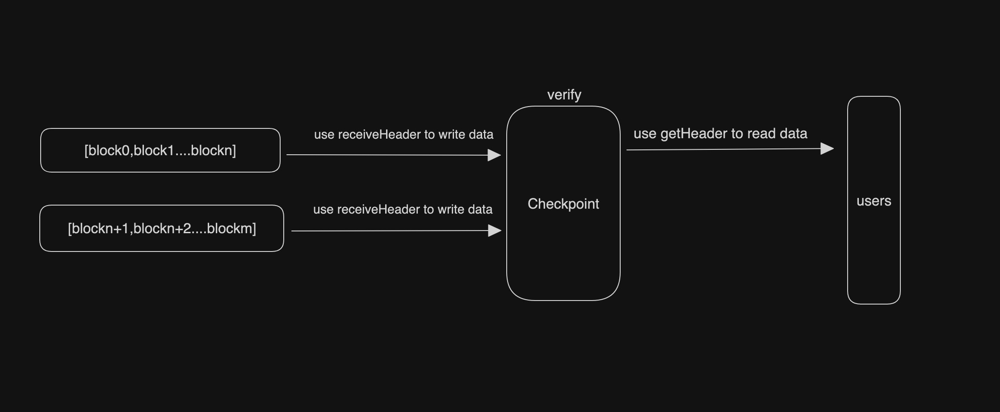

# Design

## Overview
The main job of the parent chain smart contract is to receive the block data of the subnet node, and verify and store it

###### Pay attention

   - Every received block data will be verified whether the signature is signed by validators and passed 2/3 of the votes

   - In the gap block in the middle of each epoch, next may appear, which will select next for temporary storage

   - In each epoch block, current may appear, which will select the next selected during the gap as validators from the current block to the next epoch

   - Only 3 consecutive blocks of roundNumber can confirm the previous block and `mainnetNum` will change from -1 to `block.number` once the block is committed

## Specifics
#### Checkpoint

1.Checkpoint will use these parameters to constructe the contract first

   - `address[]  initial_validator_set `: List of initial validator addresses
   - `bytes genesis_header`: block0HexRLP
   - `bytes block1_header`: block1HexRLP
   - `uint64 gap`: GAP block number on public chain
   - `uint64 epoch`: EPOCH block number on public chain

2.Relayer need to fetch every block data from subnet node

3.Users can get the information of each block from methods such as getHeader

#### Lite Checkpoint
1.Lite checkpoint will use these parameters to constructe the contract first

   - `address[]  initialValidatorSet `: List of initial validator addresses
   - `bytes block1`: block1HexRLP
   - `uint64 gap`: GAP block number on public chain
   - `uint64 epoch`: EPOCH block number on public chain

2.Relayer only need to fetch gap/epoch block data and fetch the following consecutive roundnumber blocks to confirm the signed gap/epoch block from subnet node

3.Users can get gap/epoch block information from methods such as getHeader

