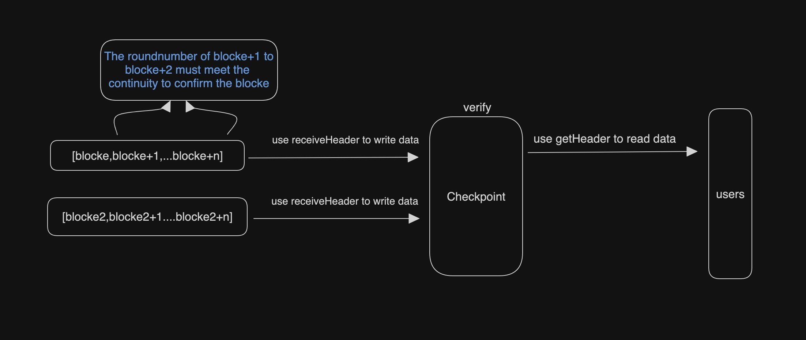

# Design

## Overview
The main job of the parent chain smart contract is to receive the block data of the subnet node, and verify and store it

###### Pay attention

   - Every received block data will be verified whether the signature is signed by validators and passed 2/3 of the votes

   - In the gap block in the middle of each epoch, next may appear, which will select next for temporary storage

   - In each epoch block, current may appear, which will select the next selected during the gap as validators from the current block to the next epoch

   - Only 3 consecutive blocks of roundNumber can confirm the previous block and `mainnetNum` will change from -1 to `block.number` once the block is committed

## Specifics
#### Checkpoint

###### Implemented a blockchain checkpoint system. This system is used to verify and store block header information for subnetworks. Here are some key functions and features:

- The contract defines multiple data structures, such as Header, HeaderInfo, Validators and BlockLite, which are used to store block header information, validator information, etc.
- The contract uses several mappings and other variables to keep track of the current block header tree, committed blocks, validator set, latest block, etc.
- In the constructor of the contract, it receives the initial validator set, the genesis block header, the first block header, etc. as parameters, and initializes the contract state on this basis.
- The receiveHeader function allows users to submit new block headers. This function will verify the meta information of the block header (such as block number, parent block hash, etc.), signature certificate, and update the submission status of the block when certain conditions are met.
- functions such as setLookup, setCommittedStatus, checkUniqueness and checkCommittedStatus are used to update or check the internal status of the contract.
- functions such as getHeader, getHeaderByNumber, getLatestBlocks and getCurrentValidators allow users to query block header information, validator sets, etc.
- The splitSignature and recoverSigner functions are used to recover the signer's address from the signature, which is necessary to verify the block header signature.

###### Logic

1.Checkpoint will use these parameters to constructe the contract first

   - `address[]  initial_validator_set `: List of initial validator addresses
   - `bytes genesis_header`: block0HexRLP
   - `bytes block1_header`: block1HexRLP
   - `uint64 gap`: GAP block number on public chain
   - `uint64 epoch`: EPOCH block number on public chain

2.Relayer need to fetch every block data from subnet node

3.Users can get the information of each block from methods such as getHeader

#### Lite Checkpoint

###### A lightweight block header checkpoint is implemented. On the whole, the code implements many functions, including:

   - When initializing the contract, set the initial validator set and set related parameters.
   - Check whether the submitted block header meets the requirements.
   - Receive and process submitted block headers.
   - Submit the block header and submit the block header by block number.
   - Get uncommitted block header information.
   - Get specific block header information.
   - Get the current and next round of epoch blocks according to the index.
   - Get the latest block information.
   - Get the current set of validators.

###### Logic

1.Lite checkpoint will use these parameters to constructe the contract first

   - `address[]  initialValidatorSet `: List of initial validator addresses
   - `bytes block1`: block1HexRLP
   - `uint64 gap`: GAP block number on public chain
   - `uint64 epoch`: EPOCH block number on public chain

2.Relayer only need to fetch gap/epoch block data and fetch the following consecutive roundnumber blocks to confirm the signed gap/epoch block from subnet node

3.Users can get gap/epoch block information from methods such as getHeader

