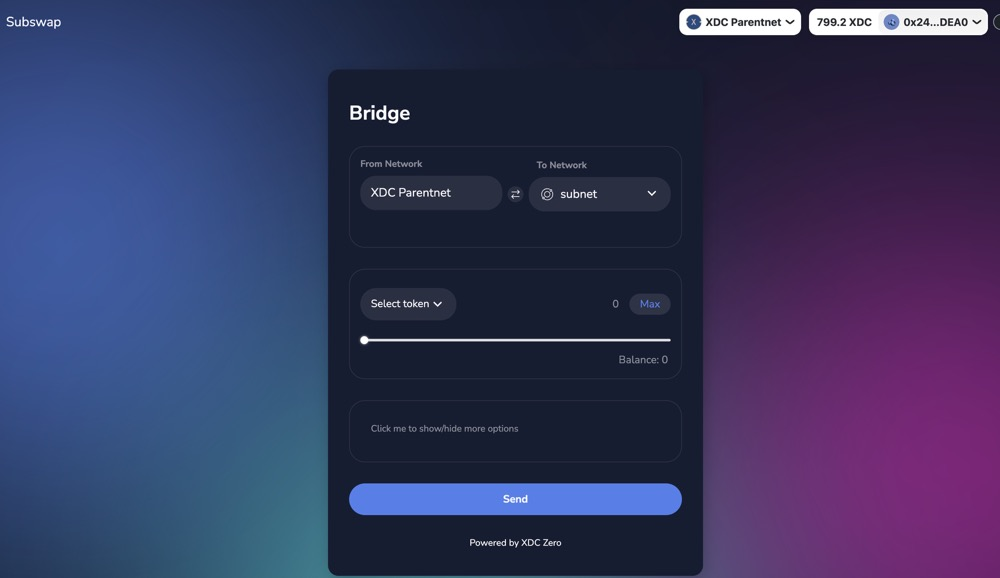
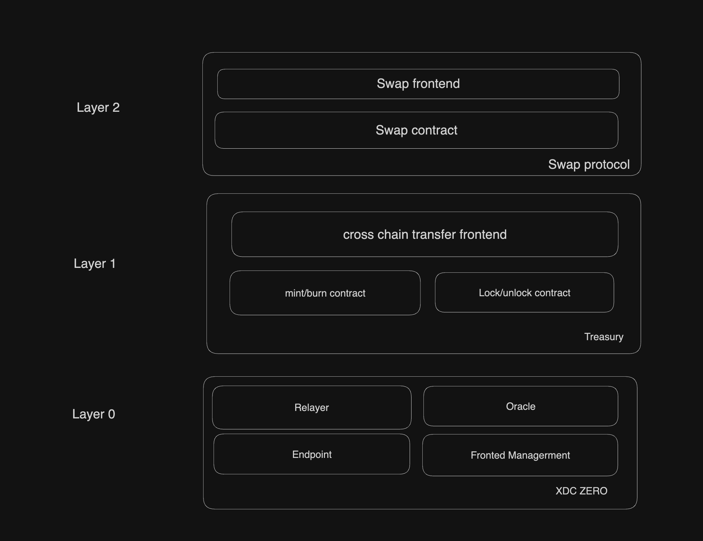

# Design
### Subswap Documentation

**Topic**: **Design of Subswap Cross-Chain Transfer System on XDC Zero**

---

#### **Overview**

Subswap is built on XDC Zero to provide seamless cross-chain transfer capabilities. It is structured in a multi-layered architecture, with each layer handling distinct functions to ensure smooth, secure, and efficient transactions across blockchain networks. This document provides a design overview of each layer, illustrating the components and their roles within the Subswap system.

---

#### **System Architecture**

Subswap is organized into three layers:

1. **Layer 0 - XDC Zero (Core Infrastructure)**
   - **Relayer**: Manages the transfer of data and assets between blockchains by relaying transaction information across chains.
   - **Oracle**: Provides reliable and up-to-date data for cross-chain operations, ensuring that the transfer protocols operate with accurate information.
   - **Endpoint**: Serves as the core communication channel within XDC Zero, connecting the layers and ensuring transactions flow smoothly.
   - **Front-End Management**: Handles the user interface and manages interactions with the underlying protocols, offering a streamlined experience for users initiating cross-chain transfers.

2. **Layer 1 - Treasury**
   - **Cross-Chain Transfer Frontend**: User-facing interface for initiating and tracking cross-chain transactions. This frontend simplifies the user experience, making it easier for users to start transfers between different blockchains.
   - **Mint/Burn Contract**: Manages asset issuance and burning on different chains. This contract mints new assets on the target chain while burning them on the source chain, maintaining asset consistency across networks.
   - **Lock/Unlock Contract**: Locks assets on the source chain and unlocks them on the target chain, ensuring that the asset's total supply remains consistent and secure across chains.

3. **Layer 2 - Swap Protocol**
   - **Swap Frontend**: Provides a user-friendly interface for initiating swaps between different assets on the Subswap platform.
   - **Swap Contract**: Executes the swap logic, managing the conversion of assets based on the predefined terms and rates, ensuring that users receive the correct assets after a swap.

---

#### **Design Considerations**

- **Security**: The use of locking and minting mechanisms prevents double-spending and ensures the security of cross-chain assets.
- **User Experience**: Frontends are designed to be intuitive, making it easy for users to interact with complex cross-chain protocols.
- **Reliability**: Oracles and relayers provide real-time data and reliable transaction relay, reducing the chance of errors in cross-chain transfers.

#### **Conclusion**

Subswap leverages XDC Zero's powerful infrastructure to deliver an efficient cross-chain transfer service. By layering its architecture, Subswap can maintain security, scalability, and ease of use, meeting the needs of users looking for seamless asset transfers across multiple blockchain networks.

## Construction(if you want to make a cross chain transfer)

