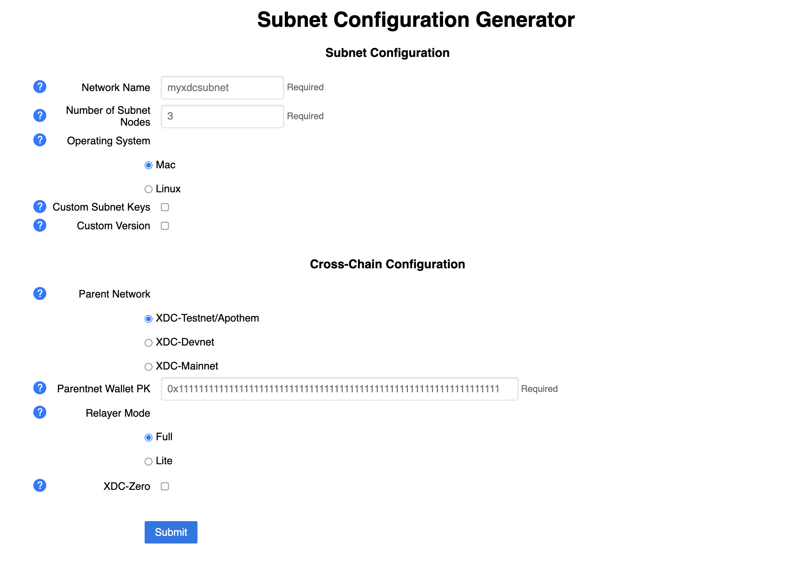

# Launch a Subnet

## Requirements
  - OS: Linux. Only Linux is supported for full deployment.

  - OS: Mac is only supported for single machine testing environment.
  
  - docker, docker compose V2. For manual installation of docker compose V2 please refer to: https://docs.docker.com/compose/install/linux/
  
  - Recommended Hardware (per single Subnet node):
    - CPU: 2 Core
    - Memory: 4 GB

  - Web3 wallet with funds. For testing we have faucets provided:
    - https://faucet.apothem.network/ 
    - https://faucet.blocksscan.io/

## Generate Subnet Configs With UI

  1. Pull `generator.sh` script from the generator Github repo
  ```
  curl -O https://raw.githubusercontent.com/XinFinOrg/XinFin-Node/generator-ui-concept/subnet/deployment-generator/scripts/generate.sh
  ```
  
  2. Run the configuration generator, this will start a local webserver
  ```
  chmod +x generate.sh
  ./generate.sh
  cd generated
  ```

  3. Go to [http://localhost:3000/](http://localhost:3000) in your browser. If you are running the generator on a remote server you can first use ssh tunnel: `ssh -N -L localhost:3000:localhost:3000 <username>@<ip_address> -i <private_key_file>`

  4. Config the Subnet options per your requirement.
  

  5. follow the generated instructions in `commands.txt`. In general, the steps are:
      - start Subnet Nodes
      - deploy CSC
      - deploy XDC-Zero (optional)
      - start Subnet Services (relayer, stats-server, frontend)

  6. Once successfully deployed, you can check out [UI usage guide](./../usage/1_homepage.md)

## Removing Subnet

  ### Shutdown Subnet
  Under `generated` directory
  ```
  docker compose --env-file docker-compose.env --profile services down 
  docker compose --env-file docker-compose.env --profile machine1 down
  ```

  ### Deleting Subnet 
  Remove `xdcchain*`, `bootnodes`, and `stats-service` directories
  Warning: this cannot be undone
  ``` 
  rm -rf xdcchain* bootnodes stats-service
  ```
