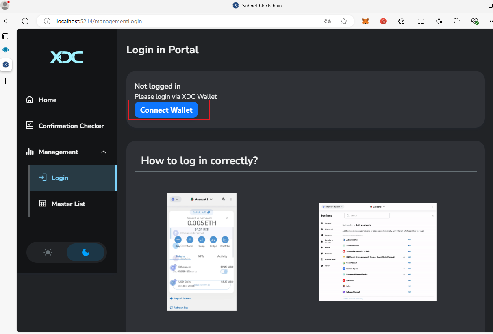
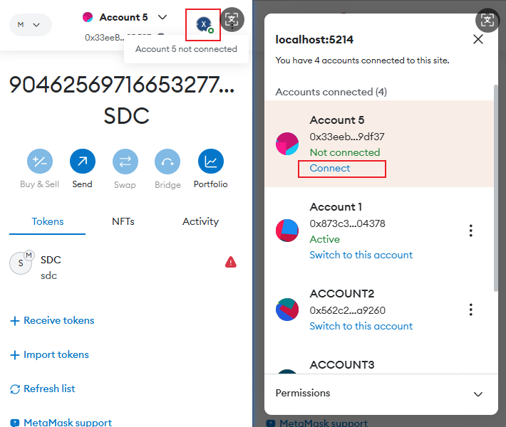
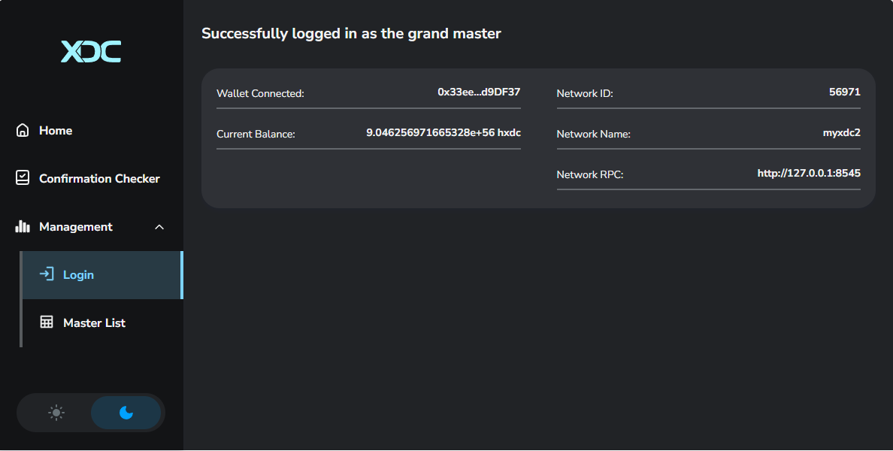
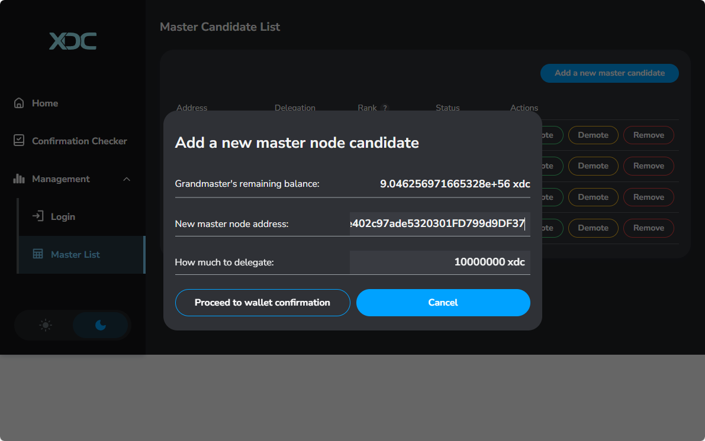
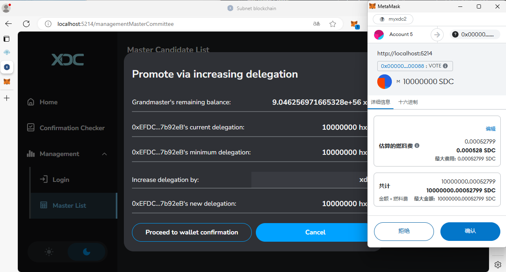
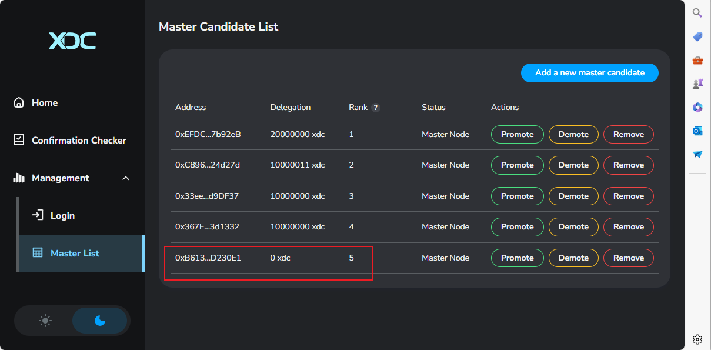

# Subnet Management

To manage the subnet, you need to use your **Grandmaster Account**. Find the **Grandmaster Key** in the `keys.json` file and import this account into your wallet.

## 1. Log in to the Wallet and Connect to the Subnet

1. Go to the correct tab and switch to the **Grandmaster Account**.
2. Click the `Connect Wallet` button.
   

3. Choose your wallet and allow the subnet network to be added. The wallet will automatically switch to this network, as shown below:

   If the wallet doesn’t switch to the subnet automatically, follow the instructions on the page to fill in the network details manually and connect to the subnet.

4. Connect the account and network.
   

You will see a confirmation page like this:

## 2. Node Operations

### 2.1 Add candidate

1. Switch to the **Master List** Tab
2. Click the `Add a new master candidate` button to add the node as a master node. **Delegation amount** must be at least `10,000,000` XDC.
   

### 2.2 Change Node Delegation

- In the list, select the node you want to change the delegation for, then click the `Promote` / `Demote` button and enter the new delegation amount.

  - If increasing the delegation, ensure the total delegation amount is over `10,000,000` XDC; otherwise, the transaction will fail.
  - If decreasing the delegation, ensure the remaining amount is still at least `10,000,000` XDC; otherwise, the transaction will fail.

    

### 2.3 Remove a Node

1. In the **Master List** Tab, select the node you want to remove, and click the `Remove` button.
2. After removal, the node’s delegated XDC will be reset to zero, and the node information will be removed from the list after one epoch.
   
